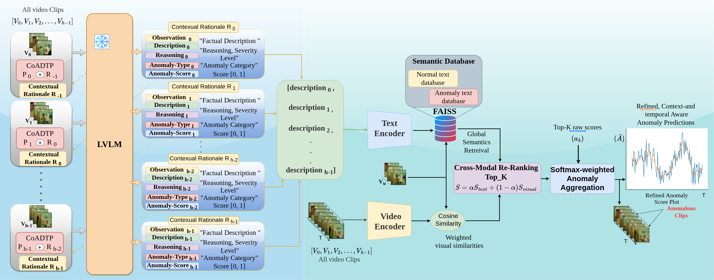

# Cog-VADU: A Training-Free Cognitive Reasoning Framework for Video Anomaly Detection and Understanding

A training-free cognitive reasoning framework for video anomaly detection using multimodal reasoning and cross-modal refinement.

[](https://openreview.net/forum?id=QcuSMNG7J8)

[**Mohd Ubaid Wani**](https://www.surrey.ac.uk/people/mohd-ubaid-wani), 
[**Sara Atito**](https://www.surrey.ac.uk/people/sara-atito), 
[**Josef Kittler**](https://www.surrey.ac.uk/people/josef-kittler), 
[**Muhammad Awais**](https://www.surrey.ac.uk/people/muhammad-awais)

**Paper:** [arXiv:2310.02835](https://arxiv.org/abs/2310.02835) | [OpenReview](https://openreview.net/forum?id=QcuSMNG7J8)

<p align="center">
  
</p>


### Abstract

Video Anomaly Detection (VAD) aims to temporally localize abnormal events in videos. Most existing approaches rely on dataset-specific training and curated annotations, limiting generalization in open-set scenarios. Recent zero-shot methods based on Large Vision-Language Models (LVLMs) alleviate this dependency but often lack temporal continuity and structured reasoning.

We propose **Cog-VADU**, a fully training-free framework that reformulates VAD as a sequential cognitive reasoning task. Cog-VADU introduces Chain-of-Anomaly Detection Thought Prompting (CoADTP), which unrolls an LVLM into a recurrent reasoning chain across video segments. By propagating structured rationales over time, the model maintains implicit temporal memory, enabling robust discrimination between complex anomalies and high-motion normal activities.

To improve reliability, we further design a cross-modal re-ranking stage that aligns textual rationales with visual embeddings, enforcing semantic consistency and temporal coherence for refined and stable predictions.

Extensive experiments on multiple public VAD benchmarks demonstrate that Cog-VADU achieves competitive zero-shot performance. Moreover, cross-model evaluations show that CoADTP consistently enhances reasoning-based anomaly detection in a model-agnostic manner, providing interpretable and generalizable anomaly understanding for real-world applications.

# Setup

## 0. Environment and Data

We recommend the use of a Linux machine with CUDA-compatible GPUs. We provide both a Conda environment to configure the required libraries. The construction of environment for running Cog-VADU relies on the backbone we choose. Please install the environment based on the backbone. For example, in this repo, we will install the environment based on the instructions provided by VideoLlama3 . We also install the some packages for ImageBind given by lavad Zanella et al. package.

For datasets, we run on UCF-Crime and XD-Violence. Please download the original videos from links provided by the authors. UCF-Crime's project page is https://www.crcv.ucf.edu/projects/real-world/ (we recommend using the dropbox link) and XD-Violence's project page is https://roc-ng.github.io/XD-Violence/. Please let us know if you cannot download from the official links and we are happy to help.

## 🛠️ Requirements and Installation

We recommend using a Linux machine with a CUDA-compatible GPU.

### Basic Dependencies

The Cog-VADU environment is based on the backbone used by the model. In this repository, we follow the environment requirements of VideoLLaMA3 and additionally install packages required by ImageBind and LAVAD Zanella et al..

- Python >= 3.10
- PyTorch >= 2.4.0
- CUDA >= 11.8
- transformers >= 4.46.3

The environment has been tested with:

- Python 3.11.11
- PyTorch 2.4.0+cu121
- PyTorch CUDA runtime 12.1
- transformers 4.46.3
- NVIDIA GeForce RTX 3090 (24 GB)

### Installation

Create and activate the Conda environment:
```bash
conda create --name cogvadu python=3.11
conda activate cogvadu
pip install -r requirements.txt
